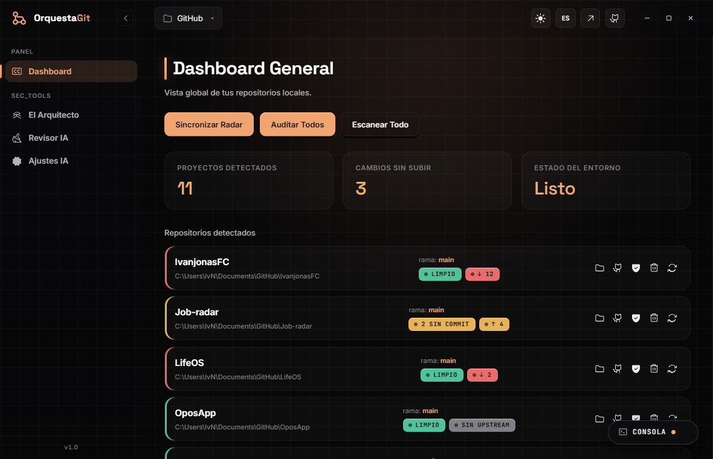

<div align="center">

# OrquestaGit

**A local, AI-assisted DevOps co-pilot for your Git repositories — one desktop app for project scaffolding, a strict pre-commit gate, security scanning, automated CI/CD and release management.**

[](https://tauri.app)
[](https://developer.mozilla.org/docs/Web/JavaScript)
[](https://www.python.org)
[](https://ollama.com)
[](LICENSE)
[](https://www.microsoft.com/windows)
[](https://github.com/IvanjonasFC/OrquestaGit/actions/workflows/ci.yml)



</div>

---

> **Status: early development.** The orchestration engine, the Control Center dashboard, the pre-commit inspector, the scaffolding module, the CI/CD generator and the SecOps engine are working. The release manager is on the roadmap below.

## What is OrquestaGit

OrquestaGit is not a traditional Git client. It is a local desktop app (built with Tauri 2) that acts as a senior DevOps engineer sitting in your taskbar: it scans every repository under a folder, shows their real state in a single Control Center, and automates the repetitive engineering work around them — scaffolding new projects the right way, blocking secrets before they reach a commit, generating CI/CD pipelines, and auditing dependencies for known vulnerabilities.

Its design goal is to remove technical bureaucracy, structure projects to a professional standard, and act as a strict customs checkpoint for code before it goes to production.

AI features run **locally by default** through [Ollama](https://ollama.com), so your source code never leaves your machine. A cloud API (OpenAI / Anthropic) is an optional fallback for low-resource machines and requires your own key, which is never stored in the repository.

## Architecture

OrquestaGit uses a three-layer design, communicating over IPC so heavy analysis never blocks the UI:

| Layer | Stack | Responsibility |
|-------|-------|----------------|
| **Frontend** | Tauri 2 + HTML / CSS / vanilla JS | Fast, lightweight Control Center UI |
| **Orchestration engine** | Python sidecar | `git` orchestration, static analysis, hooks, scaffolding |
| **AI engine** | Ollama (local) · optional cloud fallback | Code review and plain-language explanations |

The Python engine is contract-driven: every action prints a **single JSON line** so the frontend stays fully decoupled. See [`CONTROL_CENTER_SPEC.md`](CONTROL_CENTER_SPEC.md) for the UI contract and [`SECOPS_ENGINE.md`](SECOPS_ENGINE.md) for the security engine.

## Features

| Module | Status | What it does |
|--------|--------|--------------|
| **Control Center** | Working | Cache-first dashboard: repo detection, per-repo state, live console drawer |
| **The Architect** | Working | Scaffolds professional project skeletons (Python, Node, static, Tauri) and turns any repo into a reusable template |
| **The Inspector** | Working | Pre-commit gate: secret scanner (`.env`, API keys, hardcoded passwords) plus AI code review |
| **CI/CD Autopilot** | Working | Detects the stack (Node / Python / Rust / Tauri) and generates a matching GitHub Actions workflow |
| **SecOps Engine** | Working (CLI) | Aggregates Gitleaks, Trivy, osv-scanner and Semgrep into one normalized report with a quality gate |
| **Release Manager** | Planned | Builds the changelog from commit history and automates tags and GitHub Releases |

## Getting started

Requirements: Node.js 18+, the Rust stable toolchain, the [Tauri 2](https://tauri.app) CLI, Python 3.10+, and (optional) [Ollama](https://ollama.com) for local AI.

```bash
npm install
npm run tauri dev     # development, hot reload
npm run tauri build   # production binaries
```

Quick engine check without the UI:

```bash
python src/core/orquesta_core.py scan
```

> Run the app with `npm run tauri dev`, **not** `npm run dev` — the latter opens the plain browser, where Tauri's `invoke` bridge is unavailable.

## Documentation

- [`CONTROL_CENTER_SPEC.md`](CONTROL_CENTER_SPEC.md) — Control Center layout and UI design rules.
- [`SECOPS_ENGINE.md`](SECOPS_ENGINE.md) — Security engine, CLI and JSON report contract.

## Contributing

Read [`CONTRIBUTING.md`](CONTRIBUTING.md) and the [`CODE_OF_CONDUCT.md`](CODE_OF_CONDUCT.md). For security issues, see [`SECURITY.md`](SECURITY.md).

## License

Distributed under the **MIT License**. See [`LICENSE`](LICENSE).
